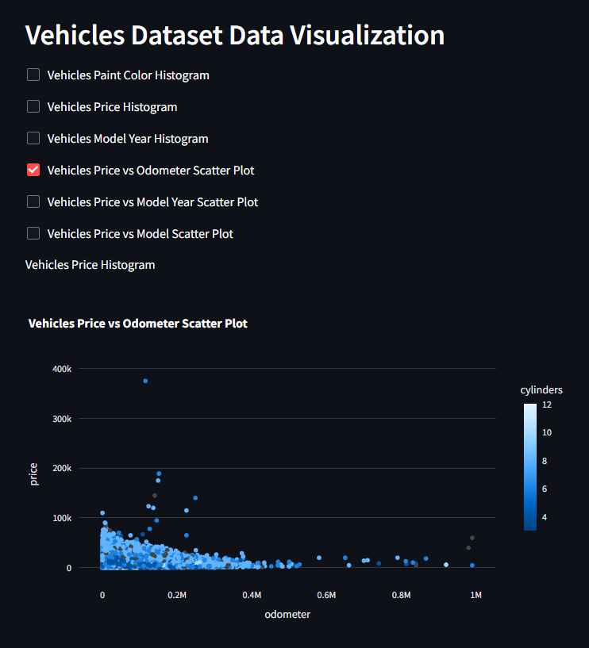

# Streamlit Vehicles Dataset Data Visualization

This Streamlit application allows you to visualize various aspects of a dataset containing information about vehicles in the United States. The app provides interactive charts and plots using Plotly Express to explore the distribution and relationships within the dataset.

## Demo on Render

[streamlit-vehicles](https://streamlit-vehicles.onrender.com/)





## Getting Started

Clone the repository:

```sh
git clone https://github.com/este6an13/streamlit-vehicles.git
```

Make sure you have the required libraries installed. You can install them using the following:

```sh
pip install --upgrade pip && pip install -r requirements.txt
```

If you are using Anaconda, follow these steps instead:

```sh
conda create --name vehicles_env
conda activate vehicles_env
conda install --file requirements.txt
```

Modify the host IP address your browser will use in the `.streamlit/config.toml` file. It should be `127.0.0.1`:

```sh
...

[browser]
serverAddress = "127.0.0.1"
serverPort = 10000
```

Run the application using the following command:

```bash
streamlit run app.py
```

## Features

### 1. Vehicles Paint Color Histogram
   - Checkbox: `Vehicles Paint Color Histogram`

### 2. Vehicles Price Histogram
   - Checkbox: `Vehicles Price Histogram`

### 3. Vehicles Model Year Histogram
   - Checkbox: `Vehicles Model Year Histogram`

### 4. Vehicles Price vs Odometer Scatter Plot
   - Checkbox: `Vehicles Price vs Odometer Scatter Plot`

### 5. Vehicles Price vs Model Year Scatter Plot
   - Checkbox: `Vehicles Price vs Model Year Scatter Plot`

### 6. Vehicles Price vs Model Scatter Plot
   - Checkbox: `Vehicles Price vs Model Scatter Plot`

## Usage

- Check the checkboxes corresponding to the plots you want to visualize.
- The selected plots will be displayed below the checkboxes.

## Dependencies

- pandas
- plotly.express
- streamlit

## Dataset

The application uses the 'vehicles_us.csv' dataset. Ensure that the dataset is in the same directory as the script.

## Tech Stack

- Anaconda
- Plotly
- Streamlit
- Render

## Notes

- Make sure to install the required dependencies before running the application.
- Adjust the script and dataset file name accordingly.

Feel free to explore and visualize different aspects of the vehicles dataset with this Streamlit application!
